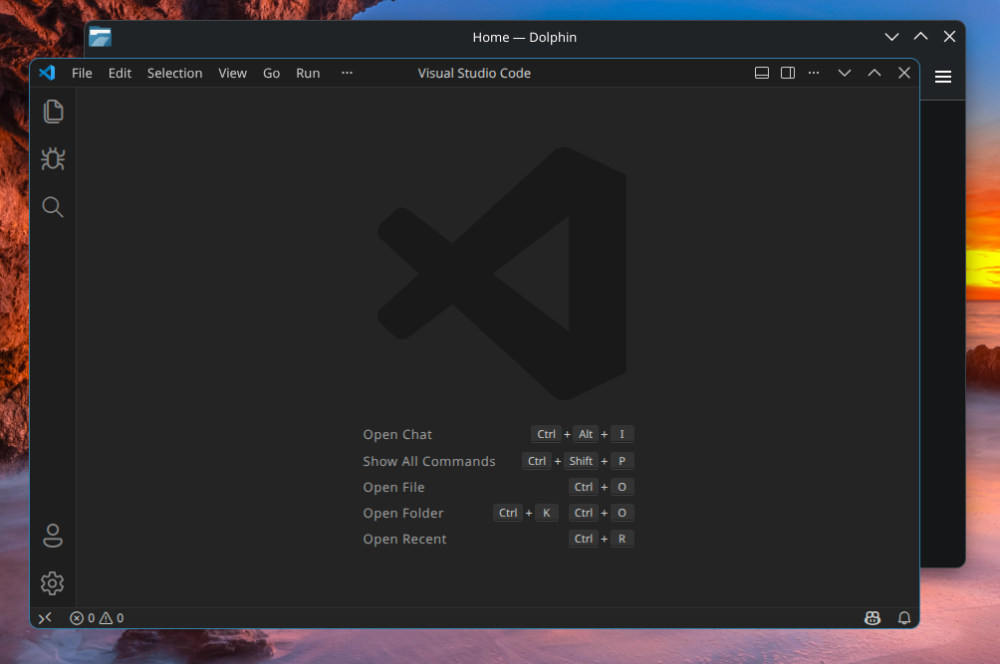
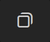
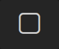

# Breeze Style Window Controls for Visual Studio Code

By default, VSCode ships with two window controls option: **custom** and **native**. If you use native, it adds compositor managed window title bar which is not really if you need more vertical screen space. Choosing custom injects Win11 style window controls, and that stands out when it's next to native or native like windows.

And here is a fix for this. Using VSCode's internal UI icon theme [codicon](https://microsoft.github.io/vscode-codicons/dist/codicon.html) components, this style replaces those icons to match Breeze default window control icons.



## Installation

1. Install an extension: You need an extension to inject CSS into VSCode first. Any extension that can inject would pretty much do the job. Just make sure you trust author and extension as it needs to access important files like your entire VSCode installation. And keep in mind that you can technically perform this by yourself like editing the files manually.

2. Fix permissions: Most extensions inject style directly to VSCode installation. It's not possible to inject on the fly due to security risks. That's why you need to make installation writable. For me, this did the job:
``` bash
sudo chown -R $(whoami) /opt/visual-studio-code
```

3. Get the CSS style: See the [releases page](https://github.com/Segilmez06/vscode-breeze-window-controls/releases/latest) for latest minified file.

4. Apply style: For this section, you need to follow your extension's documentation.

> [!IMPORTANT]
> This obviously won't work on native window controls. Make sure to choose **custom** window decorations.

## Icons

| Button Name | Default Icon                                        | Default Icon Code | Default Icon ID   | New Icon                                            | New Icon Code | New Icon ID                       |
| :---------- | :-------------------------------------------------: | :---------------: | :---------------: | :-------------------------------------------------: | :-----------: | :-------------------------------: |
| Close       |        | `\eab8`           | `chrome-close`    |        | `\ea76`       | `close`                           |
| Restore     |    | `\eabb`           | `chrome-restore`  |    | `\eaaa`       | `debug-breakpoint-log-unverified` |
| Maximize    |  | `\eab9`           | `chrome-maximize` |  | `\eab7`       | `chevron-up`                      |
| Minimize    |  | `\eaba`           | `chrome-minimize` |  | `\eab4`       | `chevron-down`                    |

## Why not a dedicated extension?

A simple CSS sheet won't justify the time required to spend for a dedicated extension that needs to handle all of those itself. If this repo gets attention, I may consider it.

## Contributing

This style is currently only tested on my system, so any patches that improve universality are greatly appreciated. I am open to PRs!

The sizing of the icons is currently made for the "large titlebar icons" window decoration setting. I am open to ideas for other sizes or even automating this in the code with variables.

If you like this project, please show your support by starring the repo.

## Credits

Created and maintained by [@Segilmez06](https://github.com/Segilmez06).
